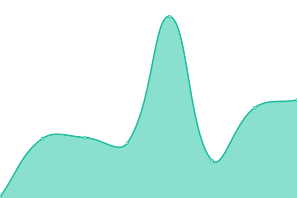
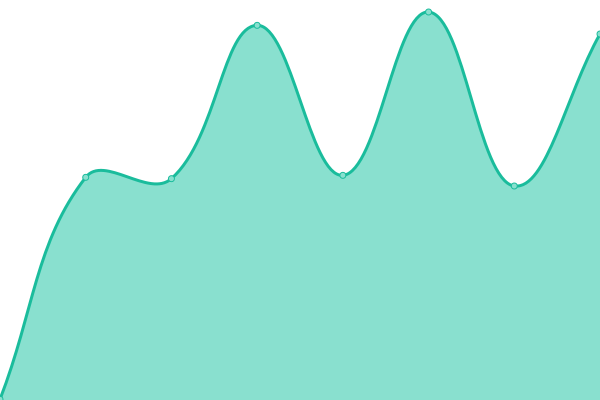
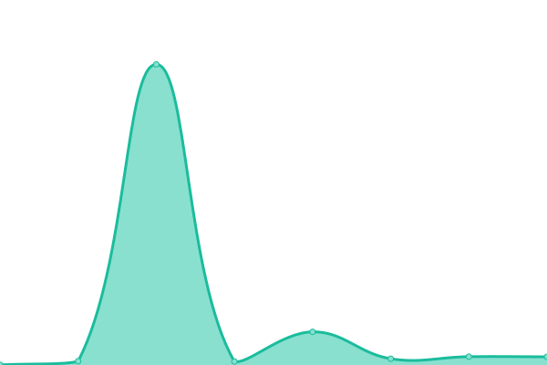
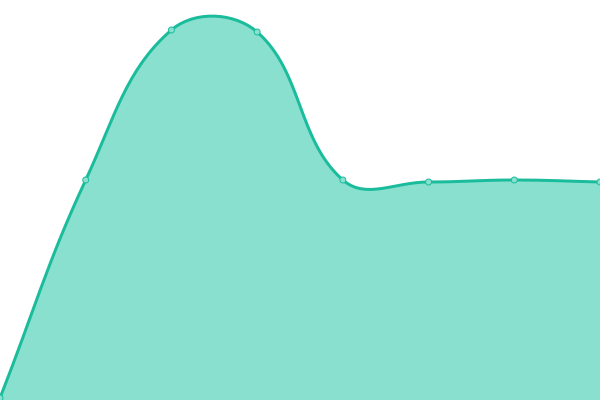
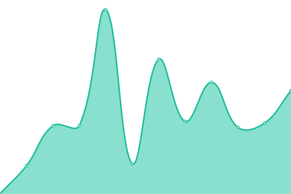
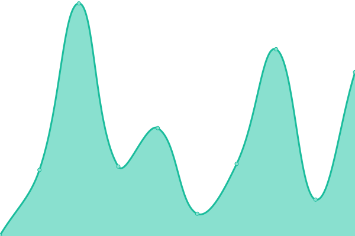
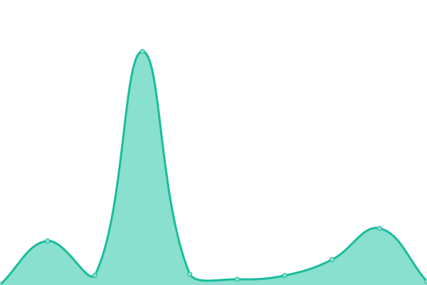
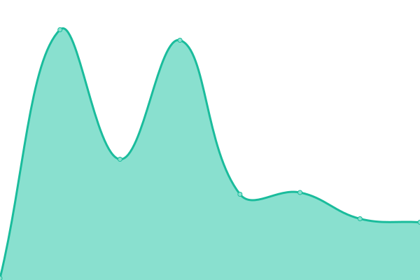
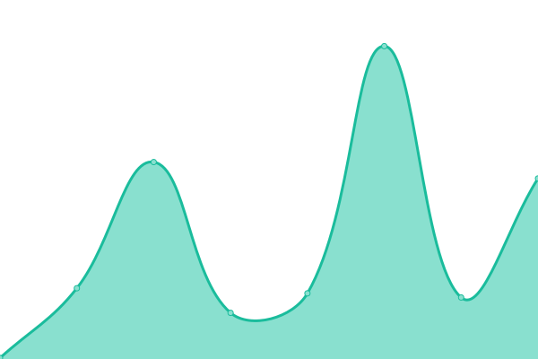

# [📈 Live Status](https://uptime.moul.io): <!--live status--> **🟩 All systems operational**

This repository contains the open-source uptime monitor and status page for [Manfred Touron](manfred.life), powered by [Upptime](https://github.com/upptime/upptime).

With [Upptime](https://upptime.js.org), you can get your own unlimited and free uptime monitor and status page, powered entirely by a GitHub repository. We use [Issues](https://github.com/moul/uptime/issues) as incident reports, [Actions](https://github.com/moul/uptime/actions) as uptime monitors, and [Pages](https://uptime.moul.io) for the status page.

<!--start: status pages-->
<!-- This summary is generated by Upptime (https://github.com/upptime/upptime) -->
<!-- Do not edit this manually, your changes will be overwritten -->
<!-- prettier-ignore -->
| URL | Status | History | Response Time | Uptime |
| --- | ------ | ------- | ------------- | ------ |
|  [berty.tech](https://www.berty.tech/) | 🟩 Up | [berty-tech.yml](https://github.com/moul/uptime/commits/HEAD/history/berty-tech.yml) | 

 297ms
     
 | 

<a href="https://uptime.moul.io/history/berty-tech">100.00%</a>
    

|  [manfred.life](https://manfred.life/) | 🟩 Up | [manfred-life.yml](https://github.com/moul/uptime/commits/HEAD/history/manfred-life.yml) | 

 516ms
     
 | 

<a href="https://uptime.moul.io/history/manfred-life">100.00%</a>
    

|  [sgtm.club](https://sgtm.club) | 🟩 Up | [sgtm-club.yml](https://github.com/moul/uptime/commits/HEAD/history/sgtm-club.yml) | 

 487ms
     
 | 

<a href="https://uptime.moul.io/history/sgtm-club">100.00%</a>
    

|  [pathwar.land](https://pathwar.land) | 🟩 Up | [pathwar-land.yml](https://github.com/moul/uptime/commits/HEAD/history/pathwar-land.yml) | 

 545ms
     
 | 

<a href="https://uptime.moul.io/history/pathwar-land">100.00%</a>
    

|  [moul.io](https://moul.io) | 🟩 Up | [moul-io.yml](https://github.com/moul/uptime/commits/HEAD/history/moul-io.yml) | 

 189ms
     
 | 

<a href="https://uptime.moul.io/history/moul-io">100.00%</a>
    

|  [makerinbox.com](https://makerinbox.com) | 🟩 Up | [makerinbox-com.yml](https://github.com/moul/uptime/commits/HEAD/history/makerinbox-com.yml) | 

 352ms
     
 | 

<a href="https://uptime.moul.io/history/makerinbox-com">100.00%</a>
    

|  [ghboard.netlify.app](https://ghboard.netlify.app) | 🟩 Up | [ghboard-netlify-app.yml](https://github.com/moul/uptime/commits/HEAD/history/ghboard-netlify-app.yml) | 

 186ms
     
 | 

<a href="https://uptime.moul.io/history/ghboard-netlify-app">100.00%</a>
    

|  [makerinbox.netlify.app](https://makerinbox.netlify.app) | 🟩 Up | [makerinbox-netlify-app.yml](https://github.com/moul/uptime/commits/HEAD/history/makerinbox-netlify-app.yml) | 

 66ms
     
 | 

<a href="https://uptime.moul.io/history/makerinbox-netlify-app">100.00%</a>
    

|  [sh.moul.io](https://sh.moul.io) | 🟩 Up | [sh-moul-io.yml](https://github.com/moul/uptime/commits/HEAD/history/sh-moul-io.yml) | 

 104ms
     
 | 

<a href="https://uptime.moul.io/history/sh-moul-io">100.00%</a>
    

|  [fwrz](fwrz.m.42.am) | 🟩 Up | [fwrz.yml](https://github.com/moul/uptime/commits/HEAD/history/fwrz.yml) | 

 108ms
     
 | 

<a href="https://uptime.moul.io/history/fwrz">100.00%</a>
    

|  [bot.moul.io](https://bot.moul.io/ping) | 🟩 Up | [bot-moul-io.yml](https://github.com/moul/uptime/commits/HEAD/history/bot-moul-io.yml) | 

 442ms
     
 | 

<a href="https://uptime.moul.io/history/bot-moul-io">100.00%</a>
    

|  [protoc-gen-gotemplate.m.42.am](https://protoc-gen-gotemplate.m.42.am/) | 🟩 Up | [protoc-gen-gotemplate-m-42-am.yml](https://github.com/moul/uptime/commits/HEAD/history/protoc-gen-gotemplate-m-42-am.yml) | 

 428ms
     
 | 

<a href="https://uptime.moul.io/history/protoc-gen-gotemplate-m-42-am">100.00%</a>
    

|  [pmgconsulting.org](https://pmgconsulting.org/) | 🟩 Up | [pmgconsulting-org.yml](https://github.com/moul/uptime/commits/HEAD/history/pmgconsulting-org.yml) | 

 113ms
     
 | 

<a href="https://uptime.moul.io/history/pmgconsulting-org">100.00%</a>
    

|  [comments.manfred.life](https://comments.manfred.life/ghi/) | 🟩 Up | [comments-manfred-life.yml](https://github.com/moul/uptime/commits/HEAD/history/comments-manfred-life.yml) | 

 142ms
     
 | 

<a href="https://uptime.moul.io/history/comments-manfred-life">100.00%</a>
    

|  [depviz-demo.moul.io](https://depviz-demo.moul.io) | 🟩 Up | [depviz-demo-moul-io.yml](https://github.com/moul/uptime/commits/HEAD/history/depviz-demo-moul-io.yml) | 

 282ms
     
 | 

<a href="https://uptime.moul.io/history/depviz-demo-moul-io">100.00%</a>
    

|  [graphman.moul.io](https://graphman.moul.io/pertify/) | 🟩 Up | [graphman-moul-io.yml](https://github.com/moul/uptime/commits/HEAD/history/graphman-moul-io.yml) | 

 137ms
     
 | 

<a href="https://uptime.moul.io/history/graphman-moul-io">100.00%</a>
    

|  [pipotron.moul.io](https://pipotron.moul.io/) | 🟩 Up | [pipotron-moul-io.yml](https://github.com/moul/uptime/commits/HEAD/history/pipotron-moul-io.yml) | 

 76ms
     
 | 

<a href="https://uptime.moul.io/history/pipotron-moul-io">100.00%</a>
    

|  [uptime.moul.io](https://uptime.moul.io/) | 🟩 Up | [uptime-moul-io.yml](https://github.com/moul/uptime/commits/HEAD/history/uptime-moul-io.yml) | 

 79ms
     
 | 

<a href="https://uptime.moul.io/history/uptime-moul-io">100.00%</a>
    

|  [uptime.berty.io](https://uptime.berty.io/) | 🟩 Up | [uptime-berty-io.yml](https://github.com/moul/uptime/commits/HEAD/history/uptime-berty-io.yml) | 

 89ms
     
 | 

<a href="https://uptime.moul.io/history/uptime-berty-io">100.00%</a>
    

|  [uptime.ultre.me](https://uptime.ultre.me/) | 🟩 Up | [uptime-ultre-me.yml](https://github.com/moul/uptime/commits/HEAD/history/uptime-ultre-me.yml) | 

 189ms
     
 | 

<a href="https://uptime.moul.io/history/uptime-ultre-me">100.00%</a>
    

|  [grpcb.in](https://grpcb.in/) | 🟩 Up | [grpcb-in.yml](https://github.com/moul/uptime/commits/HEAD/history/grpcb-in.yml) | 

 470ms
     
 | 

<a href="https://uptime.moul.io/history/grpcb-in">100.00%</a>
    

|  [zrwf](zrwf.m.42.am) | 🟩 Up | [zrwf.yml](https://github.com/moul/uptime/commits/HEAD/history/zrwf.yml) | 

 91ms
     
 | 

<a href="https://uptime.moul.io/history/zrwf">100.00%</a>
    

|  [fwrz2](fwrz2.m.42.am) | 🟩 Up | [fwrz2.yml](https://github.com/moul/uptime/commits/HEAD/history/fwrz2.yml) | 

 110ms
     
 | 

<a href="https://uptime.moul.io/history/fwrz2">100.00%</a>
    

|  [obelix](obelix.m.42.am) | 🟩 Up | [obelix.yml](https://github.com/moul/uptime/commits/HEAD/history/obelix.yml) | 

 82ms
     
 | 

<a href="https://uptime.moul.io/history/obelix">100.00%</a>
    

<!--end: status pages-->

[**Visit our status website →**](https://uptime.moul.io)

## 📄 License

- Powered by: [Upptime](https://github.com/upptime/upptime)
- Code: [MIT](./LICENSE) © [Manfred Touron](manfred.life)
- Data in the `./history` directory: [Open Database License](https://opendatacommons.org/licenses/odbl/1-0/)
