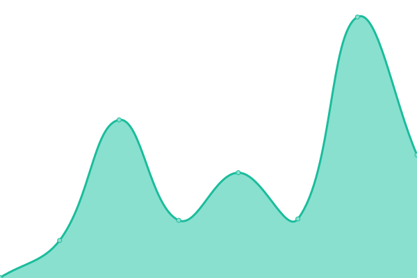

# [📈 Live Status](https://uptime.moul.io): <!--live status--> **🟩 All systems operational**

This repository contains the open-source uptime monitor and status page for [Manfred Touron](manfred.life), powered by [Upptime](https://github.com/upptime/upptime).

With [Upptime](https://upptime.js.org), you can get your own unlimited and free uptime monitor and status page, powered entirely by a GitHub repository. We use [Issues](https://github.com/moul/uptime/issues) as incident reports, [Actions](https://github.com/moul/uptime/actions) as uptime monitors, and [Pages](https://uptime.moul.io) for the status page.

<!--start: status pages-->
<!-- This summary is generated by Upptime (https://github.com/upptime/upptime) -->
<!-- Do not edit this manually, your changes will be overwritten -->
<!-- prettier-ignore -->
| URL | Status | History | Response Time | Uptime |
| --- | ------ | ------- | ------------- | ------ |
|  [berty.tech](https://www.berty.tech/) | 🟩 Up | [berty-tech.yml](https://github.com/moul/uptime/commits/HEAD/history/berty-tech.yml) | 

 407ms
     
 | 

<a href="https://uptime.moul.io/history/berty-tech">100.00%</a>
    

|  [manfred.life](https://manfred.life/) | 🟩 Up | [manfred-life.yml](https://github.com/moul/uptime/commits/HEAD/history/manfred-life.yml) | 

 455ms
     
 | 

<a href="https://uptime.moul.io/history/manfred-life">100.00%</a>
    

|  [sgtm.club](https://sgtm.club) | 🟩 Up | [sgtm-club.yml](https://github.com/moul/uptime/commits/HEAD/history/sgtm-club.yml) | 

 506ms
     
 | 

<a href="https://uptime.moul.io/history/sgtm-club">100.00%</a>
    

|  [pathwar.land](https://pathwar.land) | 🟩 Up | [pathwar-land.yml](https://github.com/moul/uptime/commits/HEAD/history/pathwar-land.yml) | 

 616ms
     
 | 

<a href="https://uptime.moul.io/history/pathwar-land">100.00%</a>
    

|  [makerinbox.com](https://makerinbox.com) | 🟩 Up | [makerinbox-com.yml](https://github.com/moul/uptime/commits/HEAD/history/makerinbox-com.yml) | 

 420ms
     
 | 

<a href="https://uptime.moul.io/history/makerinbox-com">100.00%</a>
    

|  [sh.moul.io](https://sh.moul.io) | 🟩 Up | [sh-moul-io.yml](https://github.com/moul/uptime/commits/HEAD/history/sh-moul-io.yml) | 

 533ms
     
 | 

<a href="https://uptime.moul.io/history/sh-moul-io">100.00%</a>
    

<!--end: status pages-->

[**Visit our status website →**](https://uptime.moul.io)

## 📄 License

- Powered by: [Upptime](https://github.com/upptime/upptime)
- Code: [MIT](./LICENSE) © [Manfred Touron](manfred.life)
- Data in the `./history` directory: [Open Database License](https://opendatacommons.org/licenses/odbl/1-0/)
